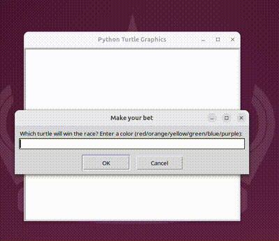

# Day 19: Event Listeners & Object State Matrices 

This repository contains the Day 19 project of the "100 Days of Code" Python challenge. The core objective was implementing event-driven execution loops and orchestrating an array of concurrent object instances.

## Project Description: Dynamic Turtle Racing
A graphical simulation where 6 discrete instances of the `Turtle` class compete on a multi-lane linear grid. The runtime intercepts string arguments from a graphical user interface window to evaluate state conditions upon thread termination.

* **Concurrent Instance Tracking:** Instantiates and manages an array of decoupled objects executing algorithmic distance steps independently.
* **Spatial Intersection Bounds:** Monitors edge thresholds ($X > 230$) inside execution iterations to prevent rendering overflows and determine winners.

## How to Run

```bash
python3 main.py