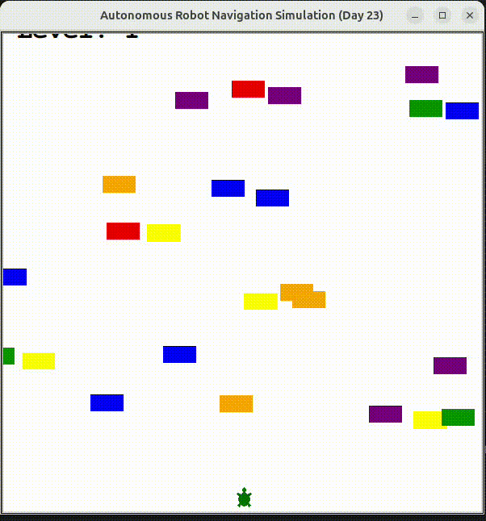

# Day 23: Obstacle Avoidance & Robotic Path Simulation 

This repository implements a real-time 2D simulation tracking obstacle avoidance algorithms and autonomous path traversal metrics using highly decoupled Object-Oriented patterns.

## Architectural Overview
The engine isolates vector calculation logic from execution frame buffers to model dynamic obstacle mapping.

* **Proximity Collision Checking:** Utilizes continuous spatial Euclidean distance matrix monitoring (`car.distance(player) < 20`) to calculate overlapping bounding box intersections.
* **Deterministic Frame Execution:** Overrides standard UI refresh pipelines via explicit memory double-buffering (`screen.tracer(0)` and `screen.update()`) achieving a stable 10Hz sampling frequency layout.
* **Probabilistic Object Generation:** Introduces density stream control via a modular pseudo-random drop filter limiting spatial crowding inside the frame coordinate windows.

## High-Res Simulation Preview


## Execution Deployment
```bash
python3 main.py