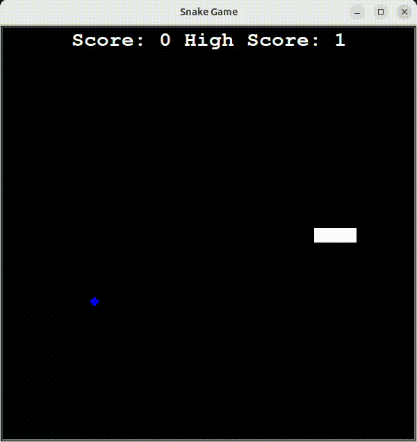

# Day 24: Non-Volatile Local Storage & Persistent State Architectures

This repository delivers a decoupled, production-grade state tracking system integrated into a real-time vector processing loop.

## High-Res Gameplay Preview


## Technical Architecture Specifications
The application shifts from standard volatile execution registers (RAM allocation) to non-volatile local disk tracking pipelines.

* **Pathlib Resolution:** Utilizes hardware-agnostic explicit object paths (`pathlib.Path`) to isolate directory context mappings across POSIX/Linux configurations.
* **Context-Managed Disk I/O:** Seals file streams inside strict exception blocks (`IOError`) ensuring crash-resilient write operations during dynamic state transitions.
* **Heap Pointer Management:** Explicitly handles memory clearing steps by offloading disconnected layout nodes from the rendering queue prior to runtime allocation resets.

## Run Command
```bash
python3 main.py