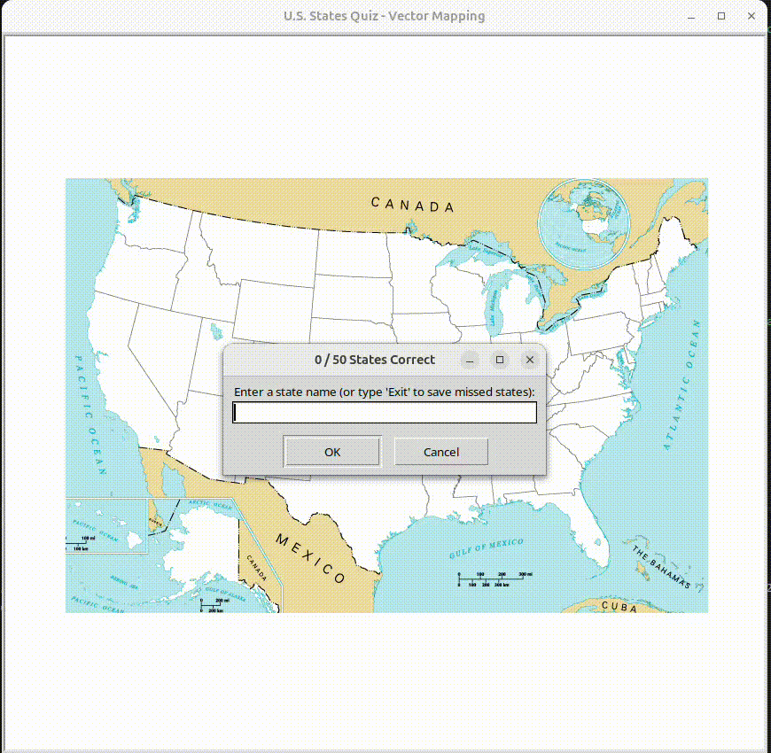

# Day 25: U.S. States Game - Coordinate Mapping & Vector Data Frames 

This repository contains the Day 25 project from the "100 Days of Code" challenge. The core objective is processing spatial database records (CSV tables) and dynamic rendering text onto specific pixel coordinate vectors using the Pandas library.

## High-Res Gameplay Preview


## Technical Architecture Specifications
The application pipeline avoids heavy iterative loops by utilizing indexed relational mapping to update the UI state.

* **Vectorized Data Filtering:** Uses low-level C-accelerated Pandas structures (`dataframe[dataframe["column"] == value]`) to perform instant string matching against the coordinate registry.
* **Coordinate Space Mapping:** Extracts dynamic discrete $(x, y)$ float variables out of structured Series objects to move rendering pointer nodes onto accurate geographical pixels.
* **Data Export Subsystem:** Utilizes list-comprehension parsing to calculate missing metrics, exporting uncompleted records into an external `states_to_learn.csv` table for persistence tracking.

## Runtime Deployment
Ensure the matrix processor package is present inside your active virtual environment:
```bash
pip install pandas